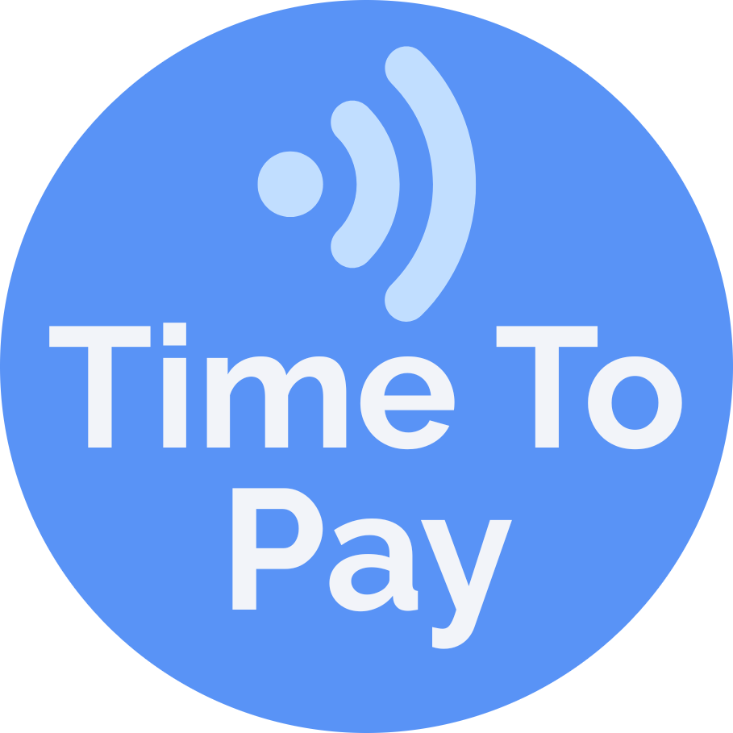

#  TimeToPay - NFC WearOS Automater 

TimeToPay is a tiny Wear OS app that automatically turns NFC off and on. Pick which apps should trigger it (Google Wallet, Samsung Wallet, etc) and NFC turns on only while those apps are open.

This app must be sideloaded. Accessibility must be enabled for this app via the watch, and the secure settings permission must be granted via ADB for needed for NFC control. This app can't be in the Play Store because of the permissions required.

## Features

- Automatic NFC control: NFC turns on while selected apps are open, and off when you leave them.
- You choose the app(s): Pick any payment app on your watch.
- Standalone: Works without a phone. No sync, no cloud, no network.

## Quick links

[Installation guide](docs/INSTALLATION.md)

[Device compatibility](docs/COMPATIBILITY.md)

[Releases](https://github.com/kattcrazy/TimeToPay/releases)

## Privacy

No network permissions, no data leaves your watch. The app compares foreground app package names to your local selection stored in SharedPreferences.

## License

This project uses the [GNU General Public License v3.0](https://www.gnu.org/licenses/gpl-3.0.html). See [LICENSE](LICENSE) for the full legal text. In short: you can use, change, and share it freely. If you distribute a modified version, you must offer it under the same license and share the source too.

## About

Leaving NFC on causes security risks (accidental payments). But you still want to pay quickly, right? Solved! 😁

Have a watch not on the compatible list? Run the [probe script](docs/COMPATIBILITY.md#run-the-probe-script) and [submit a device report](https://github.com/kattcrazy/TimeToPay/issues/new?template=device-report.yml) to help everyone else out.

If TimeToPay helps speed up your day-to-day payments, consider supporting me [here](https://kattcrazy.nz/product/support-me/) :)
